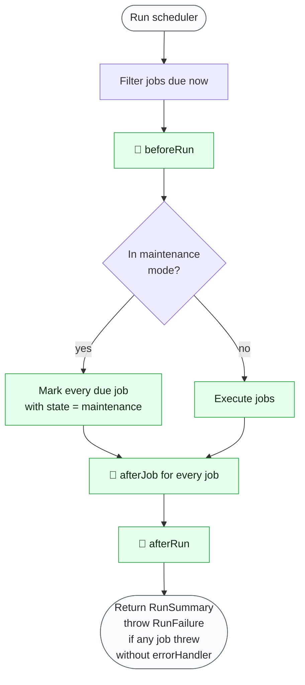
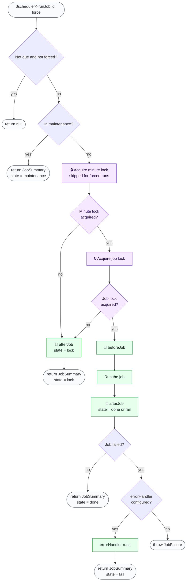
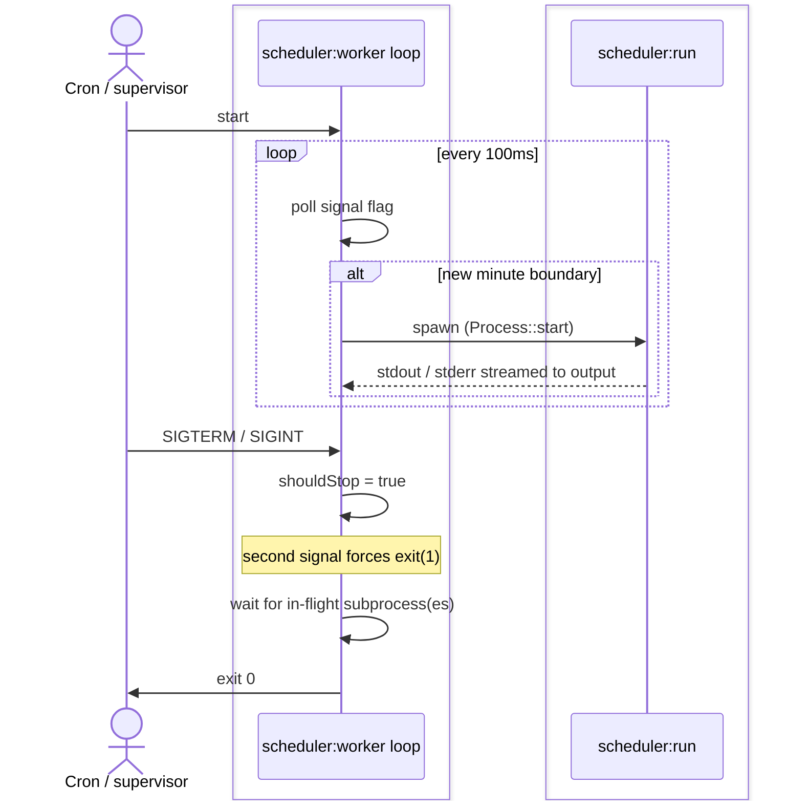

# Scheduler

Cron job scheduler – with locks, parallelism and more

## Content

- [Why do you need it?](#why-do-you-need-it)
- [Quick start](#quick-start)
- [Execution time](#execution-time)
	- [Cron expression - minutes and above](#cron-expression---minutes-and-above)
	- [Seconds](#seconds)
	- [Timezones](#timezones)
- [Events](#events)
	- [Before job event](#before-job-event)
	- [After job event](#after-job-event)
	- [Before run event](#before-run-event)
	- [After run event](#after-run-event)
	- [Tracking job executions](#tracking-job-executions)
- [Handling errors](#handling-errors)
- [Logging potential problems](#logging-potential-problems)
- [Locks and job overlapping](#locks-and-job-overlapping)
	- [Lock isolation across applications](#lock-isolation-across-applications)
	- [Multi-server protection](#multi-server-protection)
- [Parallelization and process isolation](#parallelization-and-process-isolation)
- [Job types](#job-types)
	- [Callback job](#callback-job)
	- [Custom job](#custom-job)
	- [Symfony console job](#symfony-console-job)
- [Job info and result](#job-info-and-result)
- [Run summary](#run-summary)
- [Run scheduler](#run-scheduler)
	- [Scheduler run lifecycle](#scheduler-run-lifecycle)
	- [Inside the executor](#inside-the-executor)
	- [Callback timing summary](#callback-timing-summary)
- [Run single job](#run-single-job)
	- [Single job lifecycle](#single-job-lifecycle)
- [CLI commands](#cli-commands)
	- [Run command - run jobs once](#run-command)
	- [Run job command - run single job](#run-job-command)
	- [List command - show all jobs](#list-command)
	- [Worker command - run jobs periodically](#worker-command)
		- [Worker lifecycle](#worker-lifecycle)
	- [Explain command - explain cron expression syntax](#explain-command)
- [Run tracking](#run-tracking)
	- [Status command](#status-command)
- [Maintenance mode](#maintenance-mode)
	- [Setup](#maintenance-setup)
	- [Signal handling](#signal-handling)
	- [Deploy integration](#deploy-integration)
	- [Exit codes](#exit-codes)
- [Lazy loading](#lazy-loading)
- [Integrations and extensions](#integrations-and-extensions)
- [Troubleshooting guide](#troubleshooting-guide)
	- [Running a job throws JobProcessFailure exception](#running-a-job-throws-jobprocessfailure-exception)
	- [Job starts too late](#job-starts-too-late)
	- [Job does not start at scheduled time](#job-does-not-start-at-scheduled-time)
	- [Job executions overlap](#job-executions-overlap)
	- [Job runs twice on multi-server](#job-runs-twice-on-multi-server)
	- [Scheduler does not stop during deploy](#scheduler-does-not-stop-during-deploy)

## Why do you need it?

Cron jobs configured via crontab (or a hosting-specific solution) must be registered in every environment
(e.g. local, stage, production), and the application itself is generally not aware of them.

Manage all cron jobs in the application and set them up in crontab with a single line.

> Why not any [alternative library](https://github.com/search?q=php+cron&type=repositories)? There are tons of them.

Most alternatives do not cover everything needed. By not using crontab directly, a library must replicate several
features:

- [parallelism](#parallelization-and-process-isolation) – jobs should run in parallel and start in time even if one or
  more run for a long time
- [failure protection](#handling-errors) – if one job fails, the failure should be logged and the other jobs should
  still be executed
- [cron expressions](#execution-time) – library has to parse and properly evaluate cron expression to determine whether
  job should be run

Orisai Scheduler solves all of these problems.

On top of that:

- [locking](#locks-and-job-overlapping) – each job runs only once at a time, without overlapping
- [per-second scheduling](#seconds) – run jobs multiple times in a minute
- [timezones](#timezones) – interpret job schedule within specified timezone
- [events](#events) for accessing job status
- [overview of all jobs](#list-command), including estimated time of next run
- running jobs either [once](#run-command) or [periodically](#worker-command) during development
- running just a [single](#run-single-job) job, either ignoring or respecting due times

## Quick start

Install with [Composer](https://getcomposer.org):

```sh
composer require orisai/scheduler
```

Create a script with scheduler setup (e.g. `bin/scheduler.php`):

```php
use Cron\CronExpression;
use Orisai\Scheduler\SimpleScheduler;

$scheduler = new SimpleScheduler();

// Add jobs
$scheduler->addJob(
	new CallbackJob(fn() => exampleTask()),
	new CronExpression('* * * * *'),
);

$scheduler->run();
```

Configure crontab to run the script each minute:

```
* * * * * cd path/to/project && php bin/scheduler.php >> /dev/null 2>&1
```

Good to go!

## Execution time

Execution time is determined by [cron expression](#cron-expression---minutes-and-above), which allows scheduling
jobs from once a year to once every minute, and [seconds](#seconds), allowing a job to run several times in a
minute.

In an ideal situation, jobs execute just in time, but that may not always be the case. Crontab can execute jobs several
seconds late, serial job execution may take over a minute, and long-running jobs may overlap. To prevent issues, the
scheduler implements multiple measures:

- jobs [repeated after seconds](#seconds) take in account crontab may run late and delay each execution accordingly to
  minimize unwanted gaps between executions (e.g. if crontab starts 10 seconds late, all jobs also run 10 seconds late)
- [parallel execution](#parallelization-and-process-isolation) can be used instead of the serial
- [locks](#locks-and-job-overlapping) should be used to prevent overlapping of long-running jobs

### Cron expression - minutes and above

Main job execution time is expressed via `CronExpression`, using crontab syntax:

```php
use Cron\CronExpression;

$scheduler->addJob(
	/* ... */,
	new CronExpression('* * * * *'),
);
```

Use caution with cron syntax – refer to the example below.
To validate a cron, use the [explain command](#explain-command) or
the [explainer](https://github.com/orisai/cron-expression-explainer) directly.

```
*   *   *   *   *
-   -   -   -   -
|   |   |   |   |
|   |   |   |   |
|   |   |   |   +----- day of week (0-7) (Sunday = 0 or 7) (or SUN-SAT)
|   |   |   +--------- month (1-12) (or JAN-DEC)
|   |   +------------- day of month (1-31)
|   +----------------- hour (0-23)
+--------------------- minute (0-59)
```

Each part of expression can also use wildcard, lists, ranges and steps:

- wildcard – match always
	- `* * * * *` - At every minute.
	- day of week and day of month also support `?`, an alias to `*`
- lists – match list of values, ranges and steps
	- e.g. `15,30 * * * *` - At minute 15 and 30.
- ranges – match values in range
	- e.g. `1-9 * * * *` - At every minute from 1 through 9.
- steps – match every nth value in range
	- e.g. `*/5 * * * *` - At every 5th minute.
	- e.g. `0-30/5 * * * *` - At every 5th minute from 0 through 30.
- combinations
	- e.g. `0-14,30-44 * * * *` - At every minute from 0 through 14 and every minute from 30 through 44.

Use a macro instead of an expression:

- `@yearly`, `@annually` - At 00:00 on 1st of January. (same as `0 0 1 1 *`)
- `@monthly` - At 00:00 on day-of-month 1. (same as `0 0 1 * *`)
- `@weekly` - At 00:00 on Sunday. (same as `0 0 * * 0`)
- `@daily`, `@midnight` - At 00:00. (same as `0 0 * * *`)
- `@hourly` - At minute 0. (same as `0 * * * *`)

Day of month extra features:

- nearest weekday – weekday (Monday-Friday) nearest to the given day
	- e.g. `* * 15W * *` - At every minute on a weekday nearest to the 15th.
	- If you were to specify `15W` as the value, the meaning is: "the nearest weekday to the 15th of the month"
	  So if the 15th is a Saturday, the trigger will fire on Friday the 14th.
	  If the 15th is a Sunday, the trigger will fire on Monday the 16th.
	  If the 15th is a Tuesday, then it will fire on Tuesday the 15th.
	- However, if you specify `1W` as the value for day-of-month,
	  and the 1st is a Saturday, the trigger will fire on Monday the 3rd,
	  as it will not 'jump' over the boundary of a month's days.
- last day of the month
	- e.g. `* * L * *` - At every minute on a last day-of-month.
- last weekday of the month
	- e.g. `* * LW * *` - At every minute on a last weekday.

Day of week extra features:

- nth day:
	- e.g. `* * * * 7#4` - At every minute on 4th Sunday.
	- 1-5
	- Every day of week repeats 4-5 times a month. To target the last one, use "last day" feature instead.
- last day
	- e.g. `* * * * 7L` - At every minute on the last Sunday.

### Seconds

Run a job every n seconds within a minute:

```php
use Cron\CronExpression;

$scheduler->addJob(
	/* ... */,
	new CronExpression('* * * * *'),
	/* ... */,
	1, // every second, 60 times a minute
);
```

```php
$scheduler->addJob(
	/* ... */,
	new CronExpression('* * * * *'),
	/* ... */,
	30, // every 30 seconds, 2 times a minute
);
```

With the default synchronous job executor, all jobs scheduled for the current second are executed, and only after they
finish do jobs for the next second start. With the [parallel](#parallelization-and-process-isolation) executor,
all jobs execute as soon as it is their time. Therefore, it is strongly recommended to
use [locking](#locks-and-job-overlapping) to prevent overlapping.

### Timezones

All jobs run within the timezone used by the application. Specify a different timezone for job execution time
interpretation – e.g. every midnight in Europe/Prague:

```php
use Cron\CronExpression;
use DateTimeZone;

$scheduler->addJob(
	/* ... */,
	new CronExpression('0 0 * * *'),
	/* ... */,
	/* ... */,
	new DateTimeZone('Europe/Prague'),
);
```

Some timezones use daylight saving time. When daylight saving time changes occur, a scheduled job may run twice or even
not run at all during that period. Run tasks often enough and ensure that running them more often produces expected
results.

To run a job at a specific time (e.g. midnight) in each user's timezone, run it every 15 minutes and implement
timezone-checking logic yourself. Several time zones have deviations of either 30 or 45 minutes. For instance, UTC-03:30
is the standard time in Newfoundland, while Nepal's standard time is UTC+05:45. Indian Standard Time is UTC+05:30, and
Myanmar Standard Time is UTC+06:30.

## Events

Run callbacks to collect statistics, etc.

### Before job event

Executes before a job starts.

- has [JobInfo](#job-info-and-result) available as a parameter
- does not execute if job is [locked](#locks-and-job-overlapping) — check `$result->getState() === JobResultState::lock()` in the [after job event](#after-job-event) instead
- does not execute if job is skipped due to [maintenance mode](#maintenance-mode)

```php
use Orisai\Scheduler\Status\JobInfo;

$scheduler->addBeforeJobCallback(
	function(JobInfo $info): void {
		// Executes before job start
	},
);
```

### After job event

Executes after a job reaches its final state — regardless of outcome.

- has [JobInfo and JobResult](#job-info-and-result) available as a parameter
- executes for every job state: `done`, `fail`, `lock`, `maintenance`
- inspect `$result->getState()` to distinguish between outcomes

```php
use Orisai\Scheduler\Status\JobInfo;
use Orisai\Scheduler\Status\JobResult;

$scheduler->addAfterJobCallback(
	function(JobInfo $info, JobResult $result): void {
		// Executes after every job, whether it ran, failed, was locked or skipped
	},
);
```

### Before run event

Executes before every run (every minute), even if no jobs will be executed.

- has RunInfo available as a parameter

```php
use Orisai\Scheduler\Status\RunInfo;

$scheduler->addBeforeRunCallback(
	function(RunInfo $info): void {
		$info->getStart(); // DateTimeImmutable

		foreach ($info->getJobInfos() as $jobInfo) {
			$jobInfo->getJobId(); // int|string
			$jobInfo->getName(); // string
			$jobInfo->getExpression(); // string, e.g. * * * * *
			$jobInfo->getTimeZone(); // DateTimeZone|null
			$jobInfo->getExtendedExpression(); // string, e.g. '* * * * * / 30 (Europe/Prague)'
			$jobInfo->getRepeatAfterSeconds(); // int<0, 30>
			$jobInfo->getRunsCountPerMinute(); // int<1, max>
			$jobInfo->getEstimatedStartTimes(); // list<DateTimeImmutable>
		}
	},
);
```

### After run event

Executes after every run (every minute), even if no jobs were executed.

- has [RunSummary](#run-summary) available as a parameter

```php
use Orisai\Scheduler\Status\RunSummary;

$scheduler->addAfterRunCallback(
	function(RunSummary $summary): void {
		// Executes after every run (every minute), even if no jobs were executed
	},
);
```

### Tracking job executions

Use `beforeJob` and `afterJob` callbacks for real-time tracking of job executions. The `beforeJob` callback
fires as soon as a job starts, allowing you to record it immediately – before it finishes.

Pair the callbacks using `$info->getExecutionId()` – a unique identifier derived from the job ID, run second
and start time. The same `JobInfo` instance (with the same execution ID) is passed to both callbacks.

`afterJob` fires for every job, but `beforeJob` only fires for jobs that actually ran
(see [Callback timing summary](#callback-timing-summary)). Handle the "no pending entry" case in `afterJob`
by recording the final state directly – the job never reached the `running` phase.

```php
use Example\Core\Scheduler\Db\JobRun;
use Orisai\Scheduler\Status\JobInfo;
use Orisai\Scheduler\Status\JobResult;

final class JobExecutionTracker
{

	/** @var array<string, JobRun> */
	private array $pendingRuns = [];

	public function beforeJob(JobInfo $info): void
	{
		$jobRun = new JobRun(
			jobId: $info->getJobId(),
			name: $info->getName(),
			startedAt: $info->getStart(),
		);
		$jobRun->status = 'running';

		$this->entityManager->persist($jobRun);
		$this->entityManager->flush();

		$this->pendingRuns[$info->getExecutionId()] = $jobRun;
	}

	public function afterJob(JobInfo $info, JobResult $result): void
	{
		$jobRun = $this->pendingRuns[$info->getExecutionId()] ?? null;
		unset($this->pendingRuns[$info->getExecutionId()]);

		// lock or maintenance – job never ran, no prior beforeJob call.
		if ($jobRun === null) {
			$jobRun = new JobRun(
				jobId: $info->getJobId(),
				name: $info->getName(),
				startedAt: $info->getStart(),
			);
		}

		$jobRun->finishedAt = $result->getEnd();
		$jobRun->status = $result->getState()->value;
		$jobRun->lockExpired = $result->hasLockExpiredEarly();

		$this->entityManager->persist($jobRun);
		$this->entityManager->flush();
	}

}
```

Register the callbacks:

```php
$tracker = new JobExecutionTracker(/* ... */);
$scheduler->addBeforeJobCallback([$tracker, 'beforeJob']);
$scheduler->addAfterJobCallback([$tracker, 'afterJob']);
```

## Handling errors

After all jobs finish, a `RunFailure` exception composing exceptions thrown by all jobs is thrown. This
exception reports which exceptions were thrown, including their messages and source. However, this still makes
exceptions hard to access by the application error handler and causes [CLI commands](#cli-commands) to hard fail.

To overcome this limitation, add a minimal error handler to the scheduler. When an error handler is
set, `RunFailure` is *not thrown*.

Assuming a [PSR-3 logger](https://github.com/php-fig/log), e.g. [Monolog](https://github.com/Seldaek/monolog),
is installed:

```php
use DateTimeInterface;
use Orisai\Scheduler\SimpleScheduler;
use Orisai\Scheduler\Status\JobInfo;
use Orisai\Scheduler\Status\JobResult;
use Throwable;

$errorHandler = function(Throwable $throwable, JobInfo $info, JobResult $result): void {
	$id = $info->getJobId();
	$name = $info->getName();

	$this->logger->error("Job [$id] $name failed", [
		'exception' => $throwable,
		'id' => $id,
		'name' => $name,
		'expression' => $info->getExtendedExpression(),
		'runSecond' => $info->getRunSecond(),
		'start' => $info->getStart()->format(DateTimeInterface::ATOM),
		'end' => $result->getEnd()->format(DateTimeInterface::ATOM),
		'forcedRun' => $info->isManualRun(),
	]);
},
$scheduler = new SimpleScheduler($errorHandler);
```

## Logging potential problems

Using a [PSR-3](https://www.php-fig.org/psr/psr-3/)-compatible logger
(like [Monolog](https://github.com/Seldaek/monolog)), log situations that do not fail the job but are most
certainly unwanted:

- [Lock](#locks-and-job-overlapping) was released before the job finished. The job has access to the lock and should
  extend the lock time to prevent this.

```php
use Orisai\Scheduler\SimpleScheduler;

$scheduler = new SimpleScheduler(null, null, null, null, $logger);
```

With the [process job executor](#parallelization-and-process-isolation), these situations are also logged:

- Subprocess running the job produced unexpected *stdout* output. A job should never echo or write directly to stdout.
- Subprocess running the job produced unexpected *stderr* output. This may happen due to deprecation notices but may
  also be caused by a more serious problem occurring in CLI.

```php
use Orisai\Scheduler\SimpleScheduler;
use Orisai\Scheduler\Executor\ProcessJobExecutor;

$executor = new ProcessJobExecutor(null, $logger);
$scheduler = new SimpleScheduler(null, null, $executor, null, $logger);
```

## Locks and job overlapping

Prevent time-based jobs from overlapping when they take too long and run simultaneously. Overlapping jobs accessing the
same resources (files, databases) can lead to conflicts or data corruption.

The locking mechanism ensures that only one instance of a job runs at any given time:

```php
use Orisai\Scheduler\SimpleScheduler;
use Symfony\Component\Lock\LockFactory;
use Symfony\Component\Lock\Store\FlockStore;

$lockFactory = new LockFactory(new FlockStore());
$scheduler = new SimpleScheduler(null, $lockFactory);
```

### Lock isolation across applications

If multiple applications share the same lock store (e.g. production and development on the same Redis server,
or two apps using the same Symfony module with identical job IDs), their locks will collide. A job locked by
one app will block the same job in the other.

Some stores support native isolation – use a unique path, table, or collection per app:
- **FlockStore**: unique `$lockPath` directory per app
- **PdoStore** / **DoctrineDbalStore**: unique `db_table` option per app
- **MongoDbStore**: unique `collection` per app
- **InMemoryStore**: per-process, no collision possible
- **PostgreSqlStore**: per-connection, no collision possible

For stores without native isolation (**RedisStore**, **MemcachedStore**, **SemaphoreStore**), use
`PrefixingLockFactory` which prefixes all lock keys with an app-specific string:

```php
use Orisai\Scheduler\Lock\PrefixingLockFactory;
use Orisai\Scheduler\SimpleScheduler;
use Symfony\Component\Lock\Store\RedisStore;

$store = new RedisStore($redis);
$lockFactory = new PrefixingLockFactory($store, 'MyApp/');
$scheduler = new SimpleScheduler(null, $lockFactory);
```

This turns lock keys like `Orisai.Scheduler.Job/my-job` into `MyApp/Orisai.Scheduler.Job/my-job`,
preventing collisions between applications.

To choose the right lock store, refer
to [symfony/lock](https://symfony.com/doc/current/components/lock.html) documentation. There are several available
stores with various levels of reliability, affecting when the lock is released.

> [!WARNING]
> Locks must work across processes — each `scheduler:run` invocation and each job run
> with [process job executor](#parallelization-and-process-isolation) is a separate process.
> The following stores are **incompatible** with the scheduler:
> - **InMemoryStore** — per-process, locks are not shared between separate runs
> - **PostgreSqlStore** / **DoctrineDbalPostgreSqlStore** — advisory locks are per-connection,
>   each process opens its own connection
>
> Use a cross-process store instead: FlockStore, RedisStore, PdoStore, MemcachedStore, SemaphoreStore, etc.

The lock is automatically acquired and released by the scheduler even if a (recoverable) error occurred during the job or
its events. Handle lock expiration if jobs take more than 5 minutes and an expiring store is used.

For long-running jobs, call `extendTo()` periodically to prevent lock expiration:

```php
use Orisai\Scheduler\Job\CallbackJob;
use Orisai\Scheduler\Job\JobLock;

new CallbackJob(function (JobLock $lock): void {
	$items = $this->repository->findUnprocessed();

	foreach ($items as $item) {
		// Keep the lock alive while processing — expires 120 seconds from now
		$lock->extendTo(120);
		$this->process($item);
	}
});
```

Available `JobLock` methods:

```php
$lock->extendTo(120);          // set lock expiration to 120 seconds from now
$lock->getRemainingLifetime(); // float|null - seconds until lock expires
$lock->isExpired();            // bool - whether the lock TTL has expired
```

If a lock expires before the job finishes, a warning is logged via the PSR-3 logger. Configure
a [logger](#logging-potential-problems) to be notified – this indicates the job takes longer
than the lock TTL and should use `extendTo()` to keep the lock alive.

Specify a constant ID for every added job to ensure locks work correctly during deployments – lock identifiers rely
on it. Otherwise, the job ID changes when new jobs are added before it and the acquired lock is ignored:

```php
$scheduler->addJob(
	/* ... */,
	/* ... */,
	'job-id',
);
```

### Multi-server protection

When running the scheduler on multiple servers, a job can be executed twice within the same minute:
server A finishes the job and releases its lock, then server B starts slightly later, sees no lock, and runs the same job.

The scheduler prevents this using a **minute lock** – a short-lived lock (30-second TTL) acquired before the job
runs. Unlike the job lock (which is released when the job finishes), the minute lock is never explicitly released.
It stays in the lock store until its TTL expires, preventing another server from running the same job within the
same minute.

This requires a distributed lock store (Redis, database, etc.) – `InMemoryStore` is per-process and does not
provide multi-server protection.

For sub-minute jobs (`repeatAfterSeconds > 0`), each execution second gets its own minute lock key, so different
seconds within the same minute don't interfere with each other.

Manual job execution (`$scheduler->runJob($id)`) is not affected – forced runs bypass the minute lock.

## Parallelization and process isolation

Execute scheduler tasks asynchronously in separate processes. This approach provides:

- **Isolation** – each task runs in its own process, so errors in one task do not affect others
- **Resource management** – multiple tasks execute simultaneously without causing resource conflicts
- **Efficiency** – concurrent execution reduces overall execution time
- **Scalability** – additional tasks can be added without increasing the load on any one process
- **Flexibility** – tasks run at different times and frequencies without interfering with each other

Set up the scheduler for parallelization and process isolation. This requires
[proc_*](https://www.php.net/manual/en/ref.exec.php) functions to be enabled. The [run-job command](#run-job-command)
is used in the background, so [console](#cli-commands) must be set up as well:

```php
use Orisai\Scheduler\Executor\ProcessJobExecutor;
use Orisai\Scheduler\SimpleScheduler;

$executor = new ProcessJobExecutor();
$scheduler = new SimpleScheduler(null, null, $executor);
```

If the executable script is not `bin/console` or multiple scheduler setups are used, specify the executable:

```php
use Orisai\Scheduler\Executor\ProcessJobExecutor;

$executor = new ProcessJobExecutor();
$executor->setExecutable('bin/console', 'scheduler:run-job');
```

## Job types

### Callback job

Call a given Closure when the job runs:

```php
use Closure;
use Orisai\Scheduler\Job\CallbackJob;
use Orisai\Scheduler\Job\JobLock;

$scheduler->addJob(
	new CallbackJob(Closure::fromCallable([$object, 'method'])),
	/* ... */,
);

$scheduler->addJob(
	new CallbackJob(fn(JobLock $lock) => exampleTask()),
	/* ... */,
);
```

Callback must be a function/method matching the following signature (unused parameters may be omitted). Functionality is
equal to the `run()` method of a [custom job](#custom-job):

```php
use Orisai\Scheduler\Job\JobLock;

public function example(JobLock $lock): void
{
	// Do whatever you need to
}
```

### Custom job

Create a custom job implementation.

- name should preferably be unique – it is used for [logging](#handling-errors), [event](#events) metadata and listing
  jobs in [commands](#cli-commands)
- `run()` method must throw an exception to mark the job as failed
- `run()` method may manipulate the [locking mechanism](#locks-and-job-overlapping)

```php
use Orisai\Scheduler\Job\Job;
use Orisai\Scheduler\Job\JobLock;

final class CustomJob implements Job
{

	public function getName(): string
	{
		// Provide (preferably unique) name of the job
		return static::class;
	}

	public function run(JobLock $lock): void
	{
 		// Do whatever you need to
	}

}
```

```php
$scheduler->addJob(
	new CustomJob(),
	/* ... */,
);
```

### Symfony console job

Run a [symfony/console](https://github.com/symfony/console) command as a job.

- if the job succeeds (returns zero code), command output is ignored
- if the job fails (returns non-zero code), an exception is thrown, including command return code, output and, if thrown
  by the command, the exception

```php
use Orisai\Scheduler\Job\SymfonyConsoleJob;

$job = new SymfonyConsoleJob($command, $application);
$scheduler->addJob(
	$job,
	/* ... */,
);

```

Parametrize the command:

```php
$job->setCommandParameters([
	'argument' => 'value',
	'--value-option' => 'value',
	'--no-value-option' => null,
	'--array-value-option' => ['value1', 'value2'],
]);
```

When running a command as a job, the [lock](#locks-and-job-overlapping) cannot be refreshed as with other jobs.
Instead, change the lock's default time to live to ensure the lock is not released before the job finishes:

```php
$job->setLockTtl(600); // Time in seconds
```

## Job info and result

Status information available via [events](#events) and [run summary](#run-summary).

Info:

```php
$id = $info->getJobId(); // string|int
$name = $info->getName(); // string
$expression = $info->getExpression(); // string, e.g. '* * * * *'
$repeatAfterSeconds = $info->getRepeatAfterSeconds(); // int<0, 30>
$timeZone = $info->getTimeZone(); // DateTimeZone|null
$extendedExpression = $info->getExtendedExpression(); // string, e.g. '* * * * * / 30 (Europe/Prague)'
$runSecond = $info->getRunSecond(); // int
$start = $info->getStart(); // DateTimeImmutable
$forcedRun = $info->isManualRun(); // bool, happens when running job via $scheduler->runJob() or scheduler:run-job command, ignoring the cron expression
```

Result:

```php
$end = $result->getEnd(); // DateTimeImmutable
$state = $result->getState(); // JobResultState
$earlyExpiration = $result->hasLockExpiredEarly(); // bool

// Next runs are computed from time when job was finished
$nextRun = $info->getNextRunDate(); // DateTimeImmutable
$threeNextRuns = $info->getNextRunDates(3); // list<DateTimeImmutable>
```

## Run summary

Scheduler run returns a summary for inspection:

```php
$summary = $scheduler->run(); // RunSummary

$summary->getStart(); // DateTimeImmutable
$summary->getEnd(); // DateTimeImmutable

foreach ($summary->getJobSummaries() as $jobSummary) {
	$jobSummary->getInfo(); // JobInfo
	$jobSummary->getResult(); // JobResult
}
```

Check [job info and result](#job-info-and-result) for available job status info.

## Run scheduler

Run all due jobs once. Equivalent to invoking [`scheduler:run`](#run-command) on the CLI.

```php
$summary = $scheduler->run(); // RunSummary

// Or iterate summaries as each job finishes:
foreach ($scheduler->runPromise() as $jobSummary) {
	// inspect $jobSummary incrementally
}
```

### Scheduler run lifecycle

Each run: filter due jobs by cron + timezone, check [maintenance mode](#maintenance-mode), then run the jobs through the [executor](#inside-the-executor). `beforeRun` and `afterRun` fire once per run; `afterJob` fires once per due job.



### Inside the executor

Two executors are available:

- **Basic executor** (default) runs every due job in the current process, one after another.
- **Process executor** runs each due job in its own subprocess, so jobs execute in parallel — see [Parallelization and process isolation](#parallelization-and-process-isolation).

The callback contract is identical for both: `beforeJob` fires right before the job runs, `afterJob` fires once the job reaches a terminal state, and pairing via `$info->getExecutionId()` works transparently across the process boundary.

### Callback timing summary

| Job state   | `beforeJob` | `afterJob` |
|-------------|-------------|------------|
| done        | ✓           | ✓          |
| fail        | ✓           | ✓          |
| lock        |             | ✓          |
| maintenance |             | ✓          |

## Run single job

Run a single job for testing purposes.

Assign an ID to the job when adding it to the scheduler. An auto-assigned ID visible
in [list command](#list-command) also works, but is not recommended because it depends on the order in which jobs were
added:

```php
$scheduler->addJob($job, $expression, 'id');
$scheduler->runJob('id'); // JobSummary
```

To respect the job schedule and run it only if it is due, set the 2nd parameter to `false`:

```php
$scheduler->runJob('id', false); // JobSummary|null
```

Runs respect [maintenance mode](#maintenance-mode) regardless of the `force` parameter — when maintenance is active
the job is skipped and the returned `JobSummary` has state `maintenance`. To actually execute a job during maintenance,
disable maintenance first.

[Handling errors](#handling-errors) is the same as for the `run()` method, except `JobFailure` is thrown instead
of `RunFailure`.

### Single job lifecycle

Same flow whether you call `$scheduler->runJob()` directly in PHP or invoke [`scheduler:run-job`](#run-job-command) on the CLI.



| Outcome | `beforeJob` | `afterJob` | returns |
|---------|-------------|------------|---------|
| done | ✓ | ✓ | `JobSummary` (state = `done`) |
| fail + errorHandler | ✓ | ✓ | `JobSummary` (state = `fail`) |
| fail − errorHandler | ✓ | ✓ | throws `JobFailure` |
| lock (minute or job) | | ✓ | `JobSummary` (state = `lock`) |
| maintenance | | | `JobSummary` (state = `maintenance`) |
| not due + !force | | | `null` |

## CLI commands

Commands for [symfony/console](https://github.com/symfony/console):

- [Run](#run-command)
- [Run job](#run-job-command)
- [List](#list-command)
- [Worker](#worker-command)
- [Explain](#explain-command)

> [!NOTE]
> Examples assume console is run via executable PHP script `bin/console`.

Without a DI library for handling services, register commands like this:

```php
use Symfony\Component\Console\Application;
use Orisai\Scheduler\Command\ExplainCommand;
use Orisai\Scheduler\Command\ListCommand;
use Orisai\Scheduler\Command\RunCommand;
use Orisai\Scheduler\Command\RunJobCommand;
use Orisai\Scheduler\Command\WorkerCommand;

$app = new Application();
$app->addCommands([
	new ExplainCommand($scheduler),
	new ListCommand($scheduler),
	new RunCommand($scheduler),
	new RunJobCommand($scheduler),
	new WorkerCommand(),
])
```

### Run command

Run the scheduler once, executing jobs scheduled for the current minute. CLI wrapper around [`$scheduler->run()`](#run-scheduler) — see that section for the execution lifecycle.

`bin/console scheduler:run`

Options:

- `--json` - output json with job info and result

Alternatively, change crontab settings to use the command:

```
* * * * * cd path/to/project && php bin/console scheduler:run >> /dev/null 2>&1
```

### Run job command

Run a single job, ignoring scheduled time. CLI wrapper around [`$scheduler->runJob()`](#run-single-job) — see that section for the execution lifecycle.

`bin/console scheduler:run-job <id>`

Options:

- `--no-force` - respect due time and only run job if it is due
- `--json` - output json with job info and result

### List command

List all scheduled jobs (in `expression / second (timezone) [id] name... next-due` format):

```shell
bin/console scheduler:list
bin/console scheduler:list --next=3
bin/console scheduler:list --timezone=Europe/Prague
bin/console scheduler:list --explain
bin/console scheduler:list --explain=en
```

Options:

- `--next` - sort jobs by their next execution time
	- `--next=N` lists only *N* next jobs (e.g. `--next=3` prints maximally 3)
- `-v` - display absolute times
- `--timezone` (or `-tz`) - display times in specified timezone instead of one used by application
	- e.g. `--tz=UTC`
- `--explain[=<locale>]` - explain whole expression, including [seconds](#seconds) and [timezones](#timezones)
	- [Explain command](#explain-command) with `--id` parameter can be used to explain specific job
	- e.g. `--explain`
	- e.g. `--explain=en` (to choose locale)

### Worker command

Run the scheduler repeatedly, once every minute.

> [!NOTE]
> This command should be used only for local development and requires interactive CLI.
> In production, use crontab with the [run command](#run-command).

`bin/console scheduler:worker`

- requires [proc_*](https://www.php.net/manual/en/ref.exec.php) functions to be enabled
- if the executable script is not `bin/console` or multiple scheduler setups are used, specify the executable:
	- via `your/console scheduler:worker -s=your/console -c=scheduler:run`
	- or via setter `$workerCommand->setExecutable('your/console', 'scheduler:run')`

Options:

- `--script=<script>` (or `-s`) - script executed by worker (defaults to `bin/console`)
- `--command=<command>` (or `-c`) - command executed by worker (defaults to `scheduler:run`)
- `--force` - force run when non-interactive CLI is detected (ensure the worker can be terminated!)

#### Worker lifecycle

The worker is a thin loop that spawns one `scheduler:run` subprocess per minute. It holds no locks and fires no events — everything interesting happens inside the subprocess (see [Run scheduler](#run-scheduler)).



Notes:

- First signal sets the `shouldStop` flag; second signal force-exits.
- The worker does *not* actively terminate the in-flight subprocess. If the signal comes from the terminal (Ctrl-C), it propagates to the subprocess too and triggers its own graceful shutdown. If the signal targets only the worker PID, the subprocess finishes its current minute naturally.
- All locks, events, and job orchestration live inside the `scheduler:run` subprocess.

### Explain command

Explain cron expression syntax:

```shell
bin/console scheduler:explain
bin/console scheduler:explain --id="job id"
bin/console scheduler:explain --expression="0 22 * 12 *"
bin/console scheduler:explain --expression="* 8 * * *" --seconds=10 --timezone="Europe/Prague" --locale=en
bin/console scheduler:explain -e"* 8 * * *" -s10 -tz"Europe/Prague" -len
```

Options:

- `--id=<id>` - explain specific job
	- [List command](#list-command) with `--explain` parameter can be used to explain all jobs
- `--expression=<expression>` (or `-e`) - explain expression
- `--seconds=<seconds>` (or `-s`) - repeat every n seconds
- `--timezone=<timezone>` (or `-tz`) - the timezone time should be displayed in
- `--locale=<locale>` (or `-l`) - explain in specified locale

## Run tracking

`RunRegistry` tracks active `scheduler:run` processes, useful for monitoring and for deploy scripts
to check if it is safe to proceed. Run tracking works independently of maintenance mode with any executor.

Two implementations are provided:

**FileRunRegistry** (single-server):

```php
use Orisai\Scheduler\RunRegistry\FileRunRegistry;

$registry = new FileRunRegistry(__DIR__ . '/var/scheduler-runs');
```

Stores a JSON file per active run with PID, process start time, and timestamp. Detects stale runs by:
1. Checking if the process is alive (`posix_kill($pid, 0)`)
2. Comparing process start time from `/proc` on Linux to detect PID reuse
3. Time-based fallback for systems without `/proc` (e.g. macOS)

Dead and stale processes are cleaned up automatically.

**LockPoolRunRegistry** (multi-server):

```php
use Orisai\Scheduler\RunRegistry\LockPoolRunRegistry;

$registry = new LockPoolRunRegistry($lockFactory, 10); // pool of 10 slots
```

Uses `symfony/lock` with a fixed pool of lock keys. Works with any lock store (Redis, database, etc.).
Locks are refreshed periodically to prevent TTL expiry during long runs.
If all pool slots are taken, throws `LogicException` – increase the pool size.

Pass the registry to the scheduler:

```php
use Orisai\Scheduler\SimpleScheduler;

$scheduler = new SimpleScheduler(
    null,      // errorHandler
    null,      // lockFactory
    null,      // executor
    null,      // clock
    null,      // logger
    null,      // maintenanceManager
    $registry,
);
```

### Status command

Check active runs and maintenance state:

```bash
php bin/console scheduler:status
```

Output:

```
Maintenance: UNAVAILABLE
Active runs: 2
  - 1712345678-a3f2b1 (PID 12345, started 15s ago)
  - 1712345679-d4e5c2 (PID 12346, started 3s ago)
Ready for shutdown: NO
```

Also available programmatically:

```php
$status = $scheduler->getStatus(); // ActivityStatus
$status->isMaintenanceEnabled();   // ?bool - null when maintenance not configured
$status->getActiveRuns();          // list<ActiveRun>
$status->isReadyForShutdown();     // true when maintenance active AND no active runs
```

Each `ActiveRun` provides `getId()`, `getPid()` and `getStartTimestamp()`.

## Maintenance mode

Stop running cron jobs during deployments to prevent interference. The scheduler supports
a two-phase shutdown: first it waits for running jobs to finish naturally (graceful), then force-kills any remaining
processes after a configurable grace period.

Both executors support maintenance mode:
- **ProcessJobExecutor**: force-kills child processes after the grace period expires
- **BasicJobExecutor**: stops after the current job finishes (cannot interrupt in-process execution)

### Maintenance setup

Create a `MaintenanceChecker` implementation for the environment:

```php
use Orisai\Scheduler\Maintenance\MaintenanceChecker;

class AppMaintenanceChecker implements MaintenanceChecker
{

    public function isMaintenance(): bool
    {
        return file_exists(__DIR__ . '/maintenance.running');
    }

}
```

Set up the scheduler with `MaintenanceManager` and `RunRegistry`:

```php
use Orisai\Scheduler\Command\RunCommand;
use Orisai\Scheduler\Maintenance\MaintenanceManager;
use Orisai\Scheduler\RunRegistry\FileRunRegistry;
use Orisai\Scheduler\SimpleScheduler;

$checker = new AppMaintenanceChecker();
$registry = new FileRunRegistry(__DIR__ . '/var/scheduler-runs');
$manager = new MaintenanceManager($checker);

$scheduler = new SimpleScheduler(
    null,      // errorHandler
    null,      // lockFactory
    null,      // executor
    null,      // clock
    null,      // logger
    $manager,
    $registry,
);

$runCommand = new RunCommand($scheduler, null, $manager);
```

The grace period (time before force-kill) defaults to 30 seconds. This matches the Kubernetes
`terminationGracePeriodSeconds` default – long enough for most jobs to finish DB transactions, API calls
and file operations, short enough to not block deploys excessively. Customize it:

```php
$manager = new MaintenanceManager($checker, 60); // 60 second grace period
```

### Signal handling

`RunCommand` and `WorkerCommand` handle `SIGTERM` and `SIGINT` signals:

- **RunCommand**: first signal triggers graceful shutdown (same as maintenance mode), second signal forces immediate exit
- **WorkerCommand**: first signal stops spawning new `scheduler:run` processes and waits for current ones to finish, second signal forces immediate exit

Signal handling in `RunCommand` requires `MaintenanceManager` to be passed to the command constructor.

Signal handling requires the `pcntl` extension (available on Linux/macOS CLI, not on Windows).
When pcntl is not available, signals are silently skipped – the `MaintenanceChecker` polling approach still works.

### Deploy integration

Typical deploy flow:

1. Enable maintenance (create the maintenance flag)
2. Poll `scheduler:status` with `--fail-when-not-ready-for-shutdown` until ready (exits with `0` when ready, `1` when not):

```bash
while ! php bin/console scheduler:status --fail-when-not-ready-for-shutdown; do
    sleep 1
done
```

3. Deploy the application
4. Disable maintenance (remove the maintenance flag)

### Exit codes

The `scheduler:run` command returns:

- `0` - all jobs completed successfully
- `1` - one or more jobs failed
- `2` - maintenance shutdown (run was stopped due to maintenance)

## Lazy loading

Jobs execute only when their due time arrives. Lazy load jobs to prevent initializing potentially heavy dependencies
when they are not needed. This is especially helpful
when [separate processes](#parallelization-and-process-isolation) are used:

```php
use Orisai\Scheduler\Job\Job;

$jobConstructor = function(): Job {
	// Initialize job
};
$scheduler->addLazyJob($jobConstructor, $expression, /* ... */);
```

`ManagedScheduler` serves the same purpose as `SimpleScheduler`. It is functionally identical, except:

- it requires a `JobManager` implementation as a first argument
- `addJob()` method is in `JobManager` instead of scheduler

Use the `SimpleJobManager` implementation to construct a job via a callback, or use it as an inspiration to create
a DI-specific version:

```php
use Orisai\Scheduler\Job\CallbackJob;
use Orisai\Scheduler\Job\Job;
use Orisai\Scheduler\ManagedScheduler;
use Orisai\Scheduler\Manager\SimpleJobManager;

$manager = new SimpleJobManager();
$jobConstructor = function(): Job {
	// Initialize job
};
$manager->addLazyJob($jobConstructor, $expression, /* ... */);

$scheduler = new ManagedScheduler($manager);
```

## Integrations and extensions

- [Nette](https://github.com/nette) integration – [orisai/nette-scheduler](https://github.com/orisai/nette-scheduler)

## Troubleshooting guide

Common errors and solutions.

### Running a job throws JobProcessFailure exception

A process can fail for various reasons. The most common (and known) ones are covered below.

*Stdout is empty:*

Stdout is used to return the job result as JSON. Being empty means that either the executed command is completely wrong
and does not run the job, or that the job was terminated prematurely. Premature termination may happen when the job or
one of its before/after events calls the `exit()` (or `die()`) function, or when the process is killed at system level.

*Stdout contains different output than json with job result:*

If the message says something like *Could not open input file: bin/console*, either the executable file does not exist
(change the path to executable, as described [here](#parallelization-and-process-isolation)) or permissions are set
up incorrectly.

For other stdout outputs, the command may be wrong or the command writes to stdout. While most output to
`php://output` (like `print` and `echo`) is caught and handled properly, this is not always possible.
Output may still be produced outside the PHP script, an output buffer with higher priority than the
one from job runner may be defined, or the job may have been terminated.

*Stderr contains a suppressed error:*

This means no [error handler](#handling-errors) is set or the error handler throws an exception. Set an
error handler and ensure it does not throw any exception.

### Job starts too late

Set up [parallel job executor](#parallelization-and-process-isolation). Otherwise, jobs execute one
after the other and every preceding job delays execution of the next job.

Before-run/before-job events must finish before any jobs start. Optimize them well and never use functions
like `sleep()`.

### Job does not start at scheduled time

Cron expressions are complex and interpreting them is not always easy. Use the `--explain` parameter of
the [list command](#list-command) or the [explain command](#explain-command) to explain the expression.

Check the next run date computed from the cron expression:

```php
$scheduler->getJobSchedules()['job-id']->getExpression()->getNextRunDate();
```

### Job executions overlap

Set up [locking](#locks-and-job-overlapping) and ensure the lock store works across processes. `InMemoryStore`
and `PostgreSqlStore` / `DoctrineDbalPostgreSqlStore` do not work – see the
[warning in the locks section](#locks-and-job-overlapping).

Default lock timeout is 5 minutes. If a job takes longer, the lock expires and another instance can start.
Use [`$lock->extendTo()`](#locks-and-job-overlapping) inside the job to keep the lock alive.

### Job runs twice on multi-server

The scheduler uses a [minute lock](#multi-server-protection) to prevent re-execution within the same minute.
This requires a distributed lock store (Redis, database, etc.). If two servers share the same lock store
with identical job IDs, also configure [lock isolation](#lock-isolation-across-applications).

### Scheduler does not stop during deploy

Configure [maintenance mode](#maintenance-mode) and use `scheduler:status --fail-when-not-ready-for-shutdown` to wait
for running jobs to finish before proceeding with the deploy.
